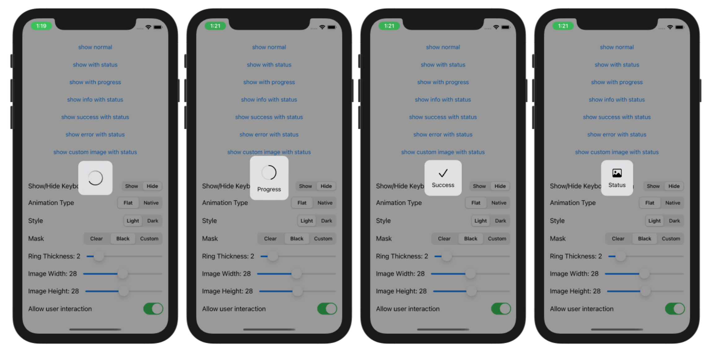
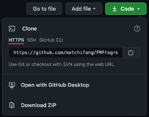
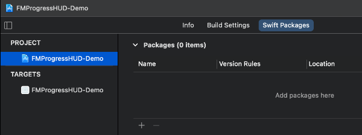
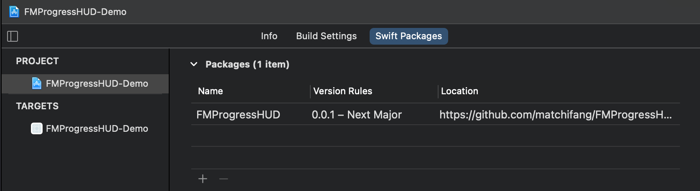
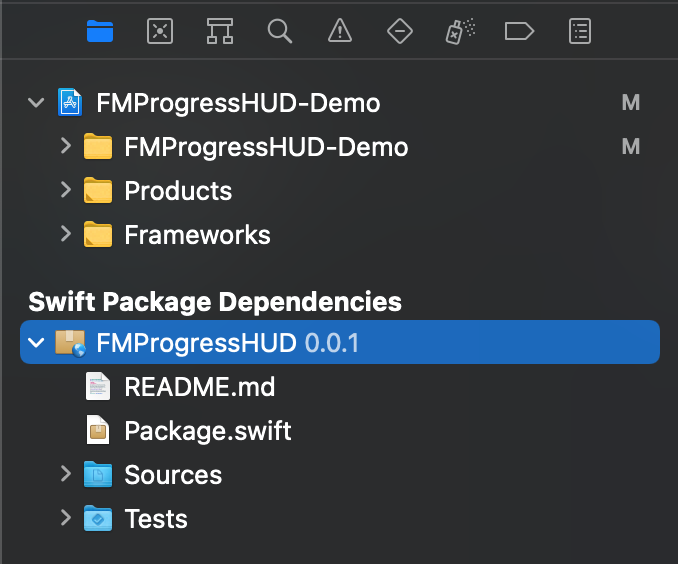

# FMProgressHUD


Swift-based HUD for showing loading spinner, progress or any image with a status. <br />
The library is compatible with Swift 5.2 and iOS 13+ <br />
HUD should show either one of the following combinations:
1. indefinite loading spinner
2. indefinite loading spinner with status
3. progress loading spinner
4. progress loading spinner with status
5. image
6. image with status



## Demo
See [FMProgressHUD-Demo](https://github.com/matchifang/FMProgressHUD-Demo) for details

## Installation

### Swift Package Manager
1. Copy the github URL for FMProgressHUD <br />


2. In Project Settings -> Swift Package Manager, click +, paste the github URL and select the version settings


3. Added packages are shown under Project Settings -> Swift Package Manager and in Project Explorer



4. Add `import FMProgressHUD` to files where you want to use the HUD

### Manual
1. Copy over the `FMProgressHUD` folder into your project
2. Add `import FMProgressHUD`

## Usage

You can show different type of HUDs using these methods:
```swift
// show indefinite loading spinner
FMProgressHUD.show()

// show progress loading spinner
// note that progess ranges from 0 to 1
FMProgressHUD.show(progress: 0.1, status: "Loading...")

// show info
FMProgressHUD.showInfo(status: "Information")

// show success
FMProgressHUD.showSuccess(status: "Success")

// show error
FMProgressHUD.showError(status: "Error")

// show any image with a status
let image = UIImage(systemName: "person.fill.checkmark")!
FMProgressHUD.show(image: image, status: "Contact added")

// dismiss the HUD
FMProgressHUD.dismiss()
```

FMProgressHUD static method configurations:
```swift
static func show(status: String? = nil)
static func showInfo(status: String? = nil)
static func showSuccess(status: String? = nil)
static func showError(status: String? = nil)
static func show(image: UIImage, status: String? = nil)
```

## Customise your HUD

The following fields can be customised:
```swift
var fadeInAnimationDuration: TimeInterval = 0.15
var fadeOutAnimationDuration: TimeInterval = 0.15
var imageSize = CGSize(width: 28, height: 28)
var animationType = FMProgressHUDAnimationType.flat // Can be: flat, native (iOS native UIActicityIndicatorView)
var hudViewCustomBlurEffect: UIBlurEffect?
var hudForegroundColor = UIColor.black 
var hudBackgroundColor = UIColor.white
var backgroundLayerColor = UIColor.clear
var maskType = FMProgressHUDMaskType.clear  // Can be: clear, black, or custom
var allowUserInteraction = true
var cornerRadius: CGFloat = 14
var ringThickness: CGFloat = 2
var labelFontSize: CGFloat = 15
var style = FMProgressHUDStyle.light // Can be: light, dark, or custom
```
### Customise AnimationType

### Customise MaskType

### Customise Style

